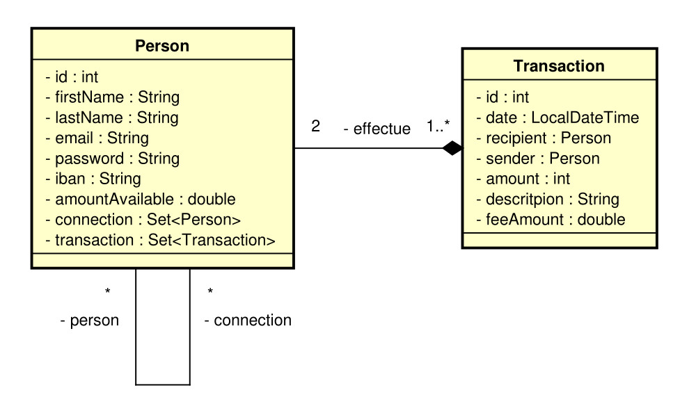
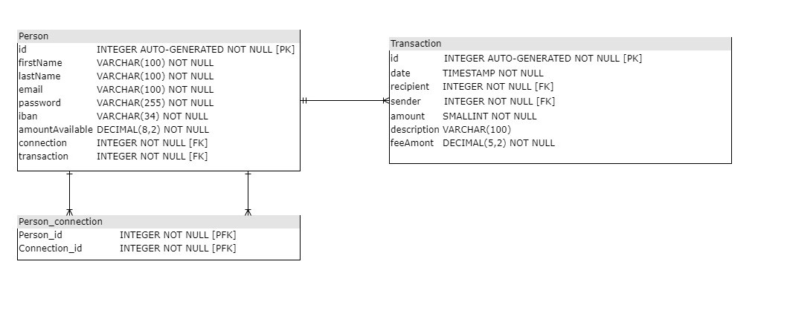

### Pay My Buddy - Back-End
This application is an API REST using Spring Boot framework and Spring Security.
The purpose of this application is a simple transfer money application.

### Class diagram

### Physical data model

### Getting Started

These instructions will get you a copy of the project up and running on your local machine for development and testing purposes. See deployment for notes on how to deploy the project on a live system.

### Prerequisites

What things you need to install the software and how to install them

- Java 1.8
- Maven 3.8.2

### Installing

A step by step series of examples that tell you how to get a development env running:

1.Install Java:

https://docs.oracle.com/javase/8/docs/technotes/guides/install/install_overview.html

2.Install Maven:

https://maven.apache.org/install.html

### Default configuration

Controller URL = http://localhost:8080/api

Port can be change in application.properties

Log file location : c:/temp/logs/paymybuddy

### Running App

Import the code into an IDE of your choice and run the PaymybuddyApplication.java to launch the application.

Or with "paymybuddy-1.0.0.jar" file, open a Terminal and execute the below command.

`java -jar paymybuddy-1.0.0.jar`

### Testing

The app has unit tests and integration tests written.

To run the tests from maven, open a Terminal and execute the below command.

`mvn verify`

### Endpoints and URLS

For more information, run app and consult : http://localhost:8080/swagger-ui/index.html

### Maven site

You can generate a maven site containing :

- FailSafe report;
- SureFire report;
- Jacoco report;

To do so, open a Terminal and execute the below command.

`mvn verify site`